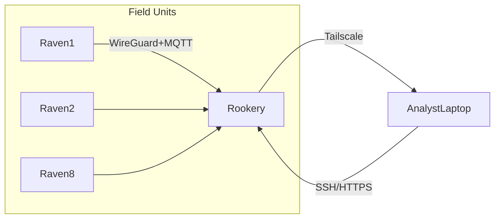

# Operational Workflows

## 1. Command & Control

* **Primary channel:** WireGuard (via Tailscale)  
* **Fallback:** HTTPS + mutual‑TLS over port 443  
* **Notifications:** `ntfy` topics (`status`, `errors`, `raven<N>`)

## 2. Daily Scan Cycle (Raven)

1. Local discovery with `arp-scan`, `nmap` (rate‑limited).
2. Conditional web enumeration (`nuclei`) if new hosts found.
3. Compress + GPG‑encrypt results → upload to Rookery.
4. Publish summary (`ntfy send raven<N> "Scan OK: 12 hosts"`).

## 3. Watchdog & Auto‑Heal

* `pi_watchdog.sh` runs every 5 min via systemd timer:  
  - Check service health (`tailscale status`, mqtt broker).  
  - On failure ➜ power‑cycle via Tasmota smart‑plug over LAN.  
  - If still offline ➜ escalate to Rookery (`errors` topic).

